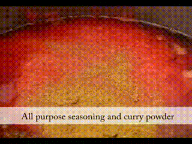

#  MAMA: A Meta-optimized Angular Margin Contrastive Framework for Video-Language Representation Learning from Large Vision Language Model


[**MAMA: A Meta-optimized Angular Margin Contrastive Framework for Video-Language Representation Learning from Large Vision Language Model**](https://arxiv.org/abs/2407.03788)

Thong Nguyen, Yi Bin, Xiaobao Wu, Xinshuai Dong, Zhiyuan Hu, Khoi Le, Cong-Duy Nguyen, See-Kiong Ng, Luu Anh Tuan
ECCV 2024

[arxiv](https://arxiv.org/abs/2407.03788) | [bibtex](#citing-mama) | [🤗 demo](https://huggingface.co/spaces/thongnguyen5999/mama) | [website](https://nguyentthong.github.io/mama)

**MAMA** (**M**eta-optimized **A**ngular **MA**rgin Contrastive Framework for Video-Language Representation Learning from Large Vision Language Model) is a novel approach to learn video-language representations from Large Vision-Language Model (LVLM). We utilize LLaVA to augment training video-text data, and utilize an angular margin-based contrastive learning combined with meta-learning to optimize the effectiveness of the LLaVA-augmented data.

**Sample Generation:**

| Video | Generation 1 | Generation 2 |
| --------|-------------|--------------|
|  | The video captures a soccer game in progress, showing multiple players on the field, with the focus on the goalie and the soccer ball. | The video captures a soccer game in progress, with multiple shots of the players on the field, showcasing various moments of the match. |

[Try out](#mama-demo) our LVLM-based pipeline to generate text descriptions for your own videos! 
You can also try out a web demo here: [](https://huggingface.co/spaces/thongnguyen5999/mama)

The resulting video-language model sets a new state-of-the-art on a number of popular video tasks!


## Introduction and installation

<span style="font-variant:small-caps;">MAMA</span> leverages Large Vision-Language Models (LVLM) as to automatically augment video-text training data, and uses these data to fine-tune strong video-language models.

### Installation

Let's begin from creating and activating a Conda environment an virtual environment. Then install the requirements:
```
conda create --name mama_env python=3.9
conda activate mama_env
pip install -r requirements.txt
```

## MAMA

MAMA consists of a subtractive angular margin contrastive objective, powered by meta-learning to weigh the important of the training video-text data.


### MAMA Demo

We provide some generated samples by our MAMA’s LVLM-based video-text data generation pipeline:

|                    |  |  | 
| :----------------: | :----------------------------------------: | :-------------------------------------: | :--------------------------------------: |
| MAMA generation   |  The video captures the driver's actions and the car's movement in a dynamic and engaging manner, providing a comprehensive view of the driving experience.    |  The video shows a person preparing a meal in multiple steps, with various ingredients and utensils being used.  |  The video shows a step-by-step process of a car being built, starting with the initial design and ending with the final product.|

Run the MAMA demo using Colab (no GPU needed): [](https://colab.research.google.com/drive/1PPeZSROlizqIwXX3eeDEhiOvPx820GbY) or 
on the web using 🤗 Spaces: [](https://huggingface.co/spaces/thongnguyen5999/mama) (thanks to [@nguyentthong](https://github.com/nguyentthong)!)

Since Colab free account offers very limited RAM, if you'd like to run the demo with a larger model, please run [./demo_mama.py](./demo_mama.py) locally. For more technical details, please refer to Section 3 in our paper.

```bash
# CPU mode
python demo_mama.py [--video-path $TEST_VIDEO]

# GPU mode
python demo_mama.py --cuda [--video-path $TEST_VIDEO]
```

## MAMA’s Augmented Data

To facilitate future research, we release our augmented data based on the HowTo100M dataset at this link.

## Citing MAMA

```bibtex
@article{nguyen2024meta,
  title={Meta-optimized Angular Margin Contrastive Framework for Video-Language Representation Learning},
  author={Nguyen, Thong and Bin, Yi and Wu, Xiaobao and Dong, Xinshuai and Hu, Zhiyuan and Le, Khoi and Nguyen, Cong-Duy and Ng, See-Kiong and Tuan, Luu Anh},
  journal={arXiv preprint arXiv:2407.03788},
  year={2024}
}
```
